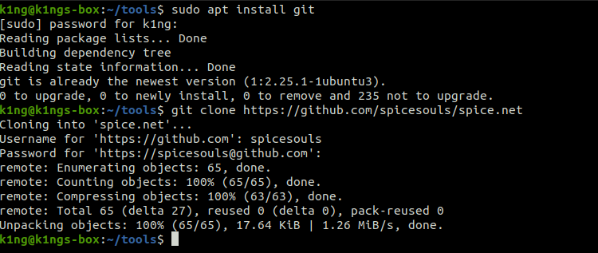
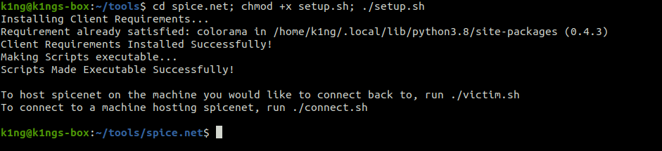
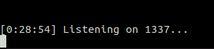
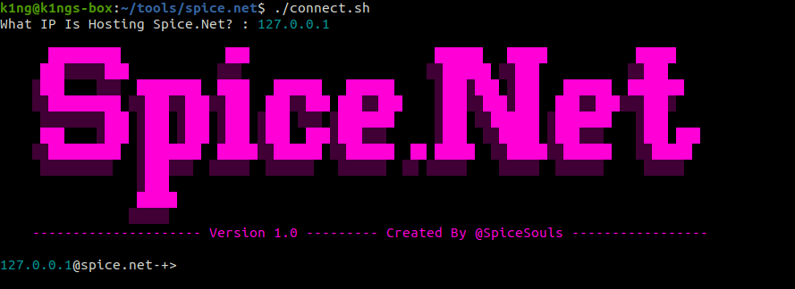

<p align="center">
  <a href="https://github.com/spicesouls/spice.net">
    
  </a>

  <h1 align="center">Spice.Net</h1>

  <p align="center">
    An opensource backdoor tool for connecting to machines and executing commands!
    <br />
    <a href="https://github.com/spicesouls/spice.net"><strong>Explore the docs »</strong></a>
    <br />
    <br />
    <a href="https://github.com/spicesouls/spice.net#guide">Installation & Usage Guide</a>
    ·
    <a href="https://github.com/spicesouls/spice.net/issues">Report Bug</a>
    ·
    <a href="https://github.com/spicesouls/spice.net/issues">Request Feature</a>
  </p>
</p>
</p>


### Table of Contents
* [About](#about)
* [Guide](#guide)
  * [Installation](#installation)
  * [Setting Up](#setting-up)
  * [Backdooring The Machine](#backdooring-the-machine)
  * [Connecting Through The Backdoor](#connecting-through-the-backdoor)
  * [Using Commands](#using-commands)
* [Examples](#examples) 
* [Contact](#contact)

## About

**Spice.Net** is a tool made for assistance with compromising and enumerating machines, as well as monitoring them and acting as a simple method to access said machine remotely. It uses `python sockets` to communicate between the compromised machine running Spice.Net and any other machine connecting using spice.net.

## Guide

Here, I'll explain how to install, set up and use Spice.Net effectively.

### Installation

To Install this, you can use the `git` command. If you don't have this command, you can install it with:
```sh
sudo apt install git
```
With the `git` command, you can install **Spice.Net** with:
```sh
git clone https://github.com/spicesouls/spice.net
```


### Setting Up

Setting up **Spice.Net** is as easy as the installation was, and can be done in as little as one line! Here it is:
```sh
cd spice.net; chmod +x setup.sh; ./setup.sh
```


### Backdooring The Machine

Now we have **Spice.Net** set up and ready, we can now plant a backdoor on our target machine! Once you've setup **Spice.Net** on your target machine, run `victim.sh`. This will host a **Spice.Net** service for you to connect back to! You can run `victim.sh` by simply using:
```sh
./victim.sh
```




### Connecting Through The Backdoor

Now we have the **Spice.Net** service running on our target machine, we can connect to the machine through this and use it as a backdoor! You can connect from any machine by running `connect.sh`. You can do this by using:
```sh
./connect.sh
```
You will then be asked for the IP of the machine that is running **Spice.Net**, so you can choose which machine to connect to!


